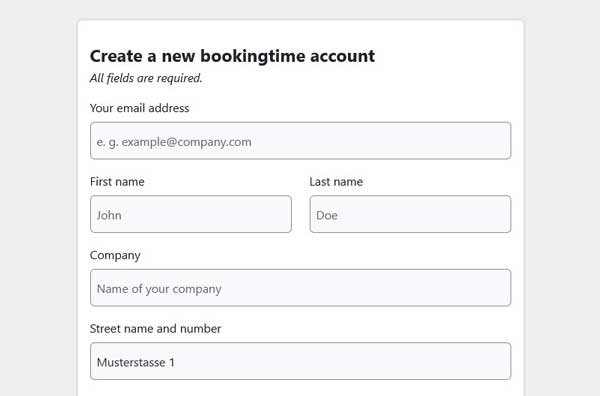
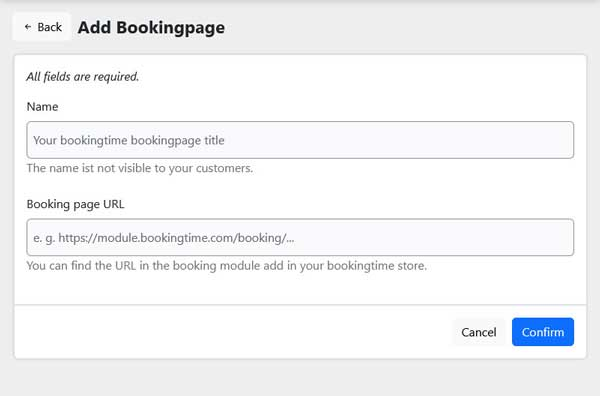
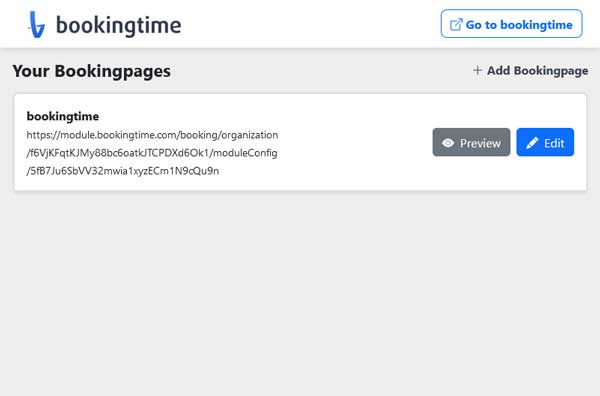
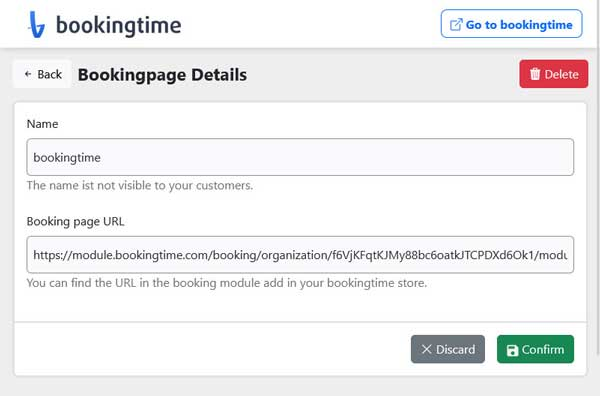
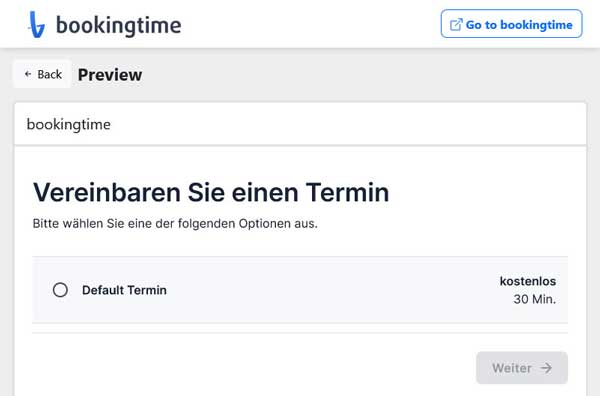
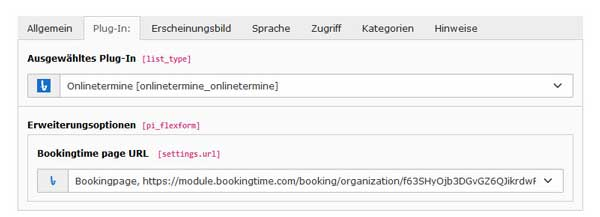
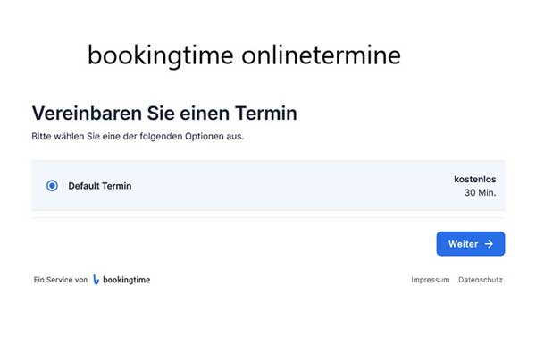

# TYPO3 Extension appointment - Documentation

This chapter describes how to work with appointment.

## Installation ##
### To install appointment, follow these steps: ###
1. Download, install and activate the bookingtime bt_appointment extension via extension manager.
2. Include the static template file: Appointment (bt_appointment)
3. Register and configure the settings at the bookingtime bt_appointment module.
4. To insert the appointment form into a page as content use the frontend plugin appointment.

## Backend module bookingtime appointment screenshots

 
*This screenshot shows page 1 after succesfull installing the extension.*  

 
*This screenshot shows the form page you have to fill out and register at bookingtime.*  

 
*This screenshot shows the add page for an appointment url.*  

 
*This screenshot shows the list page of your appointment urls.*  

 
*This screenshot shows the edit page of your appointment url.*  

 
*This screenshot shows the preview page of your appointment url.*  

## Frontend plugin appointment screenshots

 
*This screenshot shows the inserting of your appointment url by TYPO3 frontend plugin appointment.*  

 
*This screenshot shows the result of the appointment url in the frontend.*

---
Copyright 2014 bookingtime GmbH. All Rights Reserved.

Made with :blue_heart: by © bookingtime

